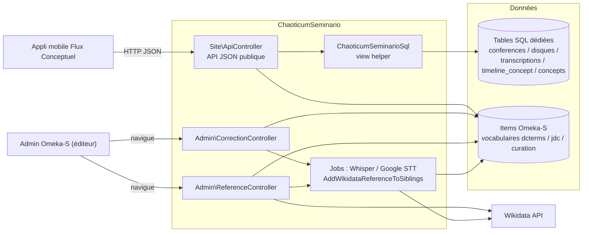
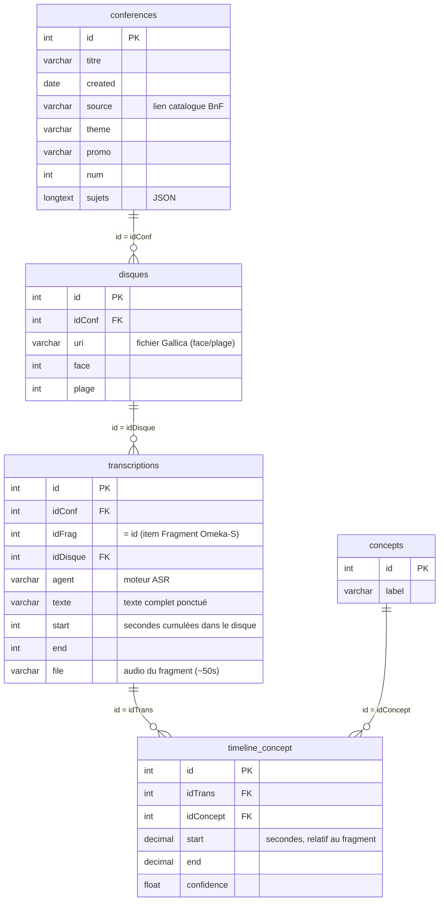
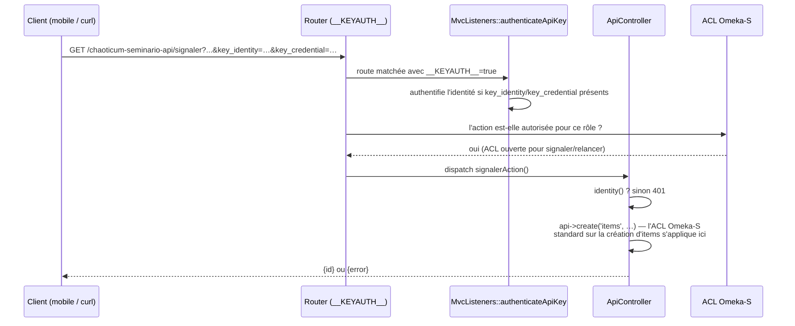
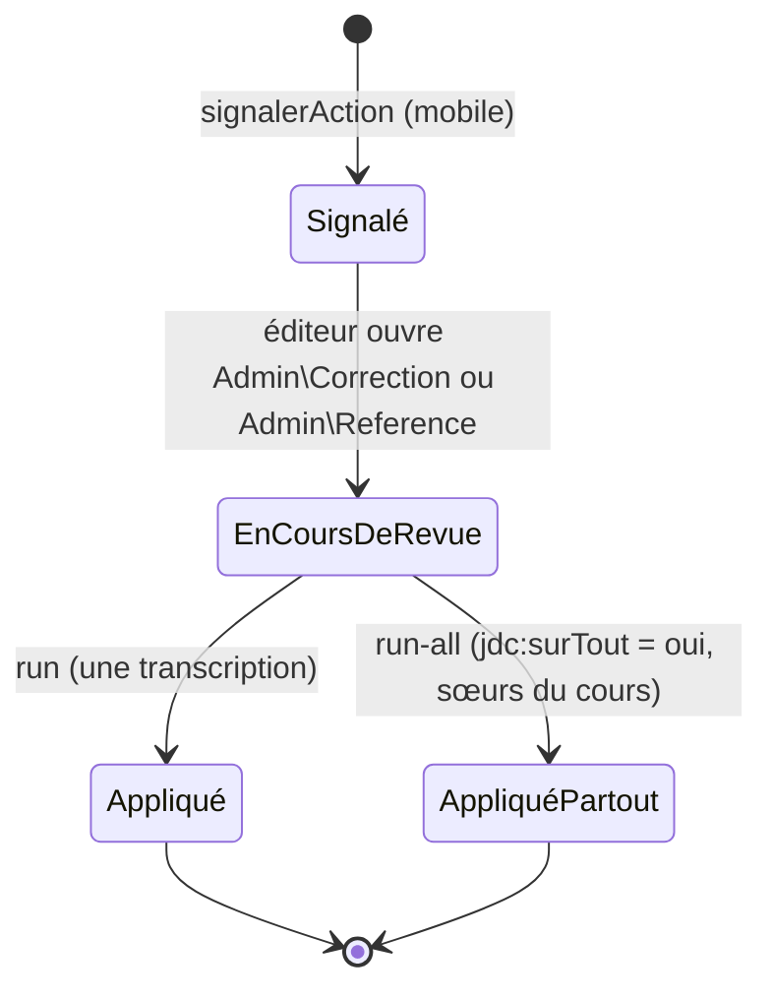
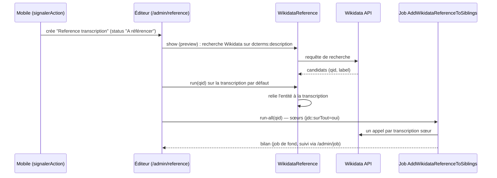

# ChaoticumSeminario

Module Omeka-S pour l'édition chaotique d'un séminaire : indexation, recherche et curation collaborative des cours de Gilles Deleuze (BnF/Gallica) dans Omeka-S, au-delà du modèle de données RDF standard (tables SQL dédiées pour les transcriptions et concepts, jobs de traitement audio, intégrations IA).

Ce document couvre en détail les parties utilisées par l'application mobile [Flux Conceptuel](../../../exploDeleuze/mobilapp/fluxconceptuel) : l'API JSON du site, le modèle de signalement collaboratif et le flux de curation associé. Les autres fonctionnalités du module (Semafor, AnythingLLM, PdfToMarkdown, Datavis, blocs de site) ne sont que listées en fin de document.

## Vue d'ensemble

## Modèle de données des transcriptions

Les cours, leurs enregistrements audio, les transcriptions et les concepts (mots) horodatés vivent dans des **tables SQL dédiées** (hors modèle RDF Omeka-S), accessibles via le view helper `ChaoticumSeminarioSql` (`$this->chaoticumSeminarioSql`) :

`ChaoticumSeminarioSql::timelineConceptAnnexe()` est la requête pivot : elle joint ces cinq tables pour reconstituer, par fragment, le texte complet et la liste des tokens ASR horodatés consommés par le client mobile.

## API JSON du site (`Controller\Site\ApiController`)

Montée sous `/s/{slug}/chaoticum-seminario-api/{action}` (route `chaoticum-seminario-api` dans `config/module.config.php`), avec le drapeau de route `__KEYAUTH__` activé : cette route reconnaît donc l'authentification par clé API (`?key_identity=…&key_credential=…`), comme les routes `/api/*` du cœur Omeka-S, mais permet en plus un accès public par défaut (ACL) pour les actions de lecture.

| Action | Auth | Description |
|---|---|---|
| `listconferences` | publique | Liste des cours + statistiques (`getConferences`) |
| `transcriptions?idConf=` | publique | Transcriptions d'un cours, texte complet + concepts horodatés |
| `cherche?trouve=` | publique | Recherche plein texte (`MATCH…AGAINST`) sur `transcriptions.texte` |
| `relancer?idFrag=&modele=` | **requise** | Dispatch un job Whisper/Google pour re-transcrire un fragment |
| `signaler?...` | **requise** | Crée un signalement léger (correction ou référence) |
| `conferences`, `delconf` | ACL/rôle | Actions d'administration historiques, non utilisées par le client mobile |

Seules `listconferences`, `transcriptions`, `cherche`, `relancer` et `signaler` sont explicitement ouvertes dans l'ACL du contrôleur (`Module::onBootstrap`) ; les deux dernières vérifient en plus `$this->identity()` en tout début d'action (401 sinon). Sans cette entrée ACL, Omeka-S refuse même d'atteindre l'action (avant que ce contrôle interne ne s'exécute).

## Signalement collaboratif et curation

Le client mobile crée des items **légers** (`signalerAction`), destinés à être triés plus tard par un éditeur — il ne crée jamais lui-même de correction ou de référence "définitive". Deux `resource_template` structurent ces signalements :

- **Correction transcription** (`type=correction`) : propriétés `jdc:remplacer` / `jdc:par` / `jdc:surTout`, `dcterms:source` (pointe vers la transcription), `curation:status`.
- **Reference transcription** (`type=personne|oeuvre|date|lieu`) : `dcterms:description` (texte libre décrivant la référence), `dcterms:temporal` (horodatage), `curation:status`.

### Corrections (`Admin\CorrectionController` + `TranscriptionCorrection`)

`/admin/correction` liste les items "Correction transcription" (triable par date/statut). `show` prévisualise les correspondances de `jdc:remplacer` dans la transcription ciblée (`dcterms:source`, ou déduite). `run`/`run-all` remplacent le texte dans le titre, les segments et les concepts-mots de la ou des transcriptions sœurs, en traçant chaque annotation modifiée via `oa:motivatedBy`.

### Références (`Admin\ReferenceController` + `WikidataReference`)

`/admin/reference` liste les items "Reference transcription", filtrables par statut. `show` recherche automatiquement sur Wikidata à partir de `dcterms:description`. `run` relie l'entité Wikidata choisie (`qid`) à la transcription (et crée un item "ref Personne" si besoin, pour le type personne). `run-all` dispatch un **job en tâche de fond** (`AddWikidataReferenceToSiblings`) plutôt qu'un traitement synchrone, chaque transcription sœur impliquant un appel réseau à Wikidata.

## Relance de transcription (`relancerAction`)

Dispatch un job `WhisperSpeechToText` ou `GoogleSpeechToText` (`Omeka\Job\Dispatcher`) avec `ids => [idFrag]`, `idFrag` étant l'identifiant de l'item Omeka-S représentant le fragment audio. Chaque job invoque le view helper correspondant (`whisperSpeechToText` / `googleSpeechToText`), qui traite l'audio et réécrit l'item Fragment (titre, référence média, agent).

## Autres fonctionnalités du module

Non documentées en détail ici (hors périmètre de l'appli mobile) :

- **Semafor** — extraction de compétences/relations, visualisations Datavis (`datasetCompetencesRelationships`).
- **AnythingLLM** — intégration d'un assistant IA local pour interroger les cours.
- **PdfToMarkdown**, **TransformersPipeline** — pipelines de traitement de documents et de classification.
- **Blocs de site** (`Site\BlockLayout`) — affichage des conférences dans les pages Omeka-S.
- **BatchEditSemafor** — champ de formulaire pour lancer les traitements en masse depuis l'admin.
